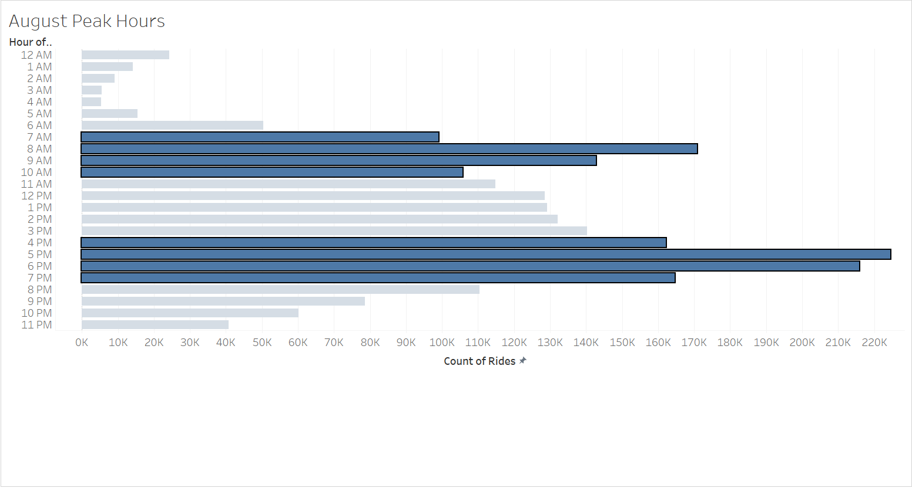
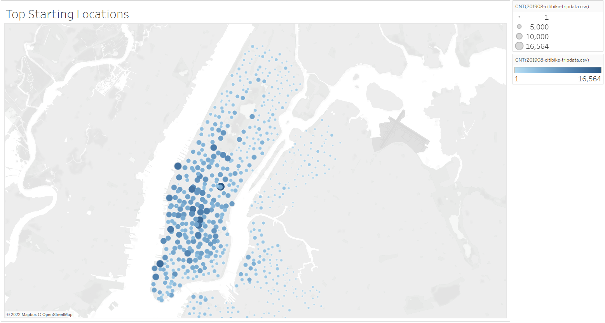
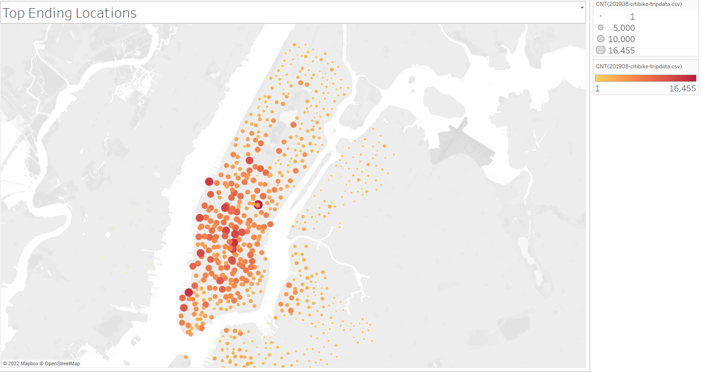
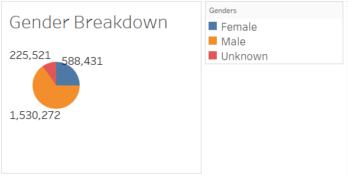
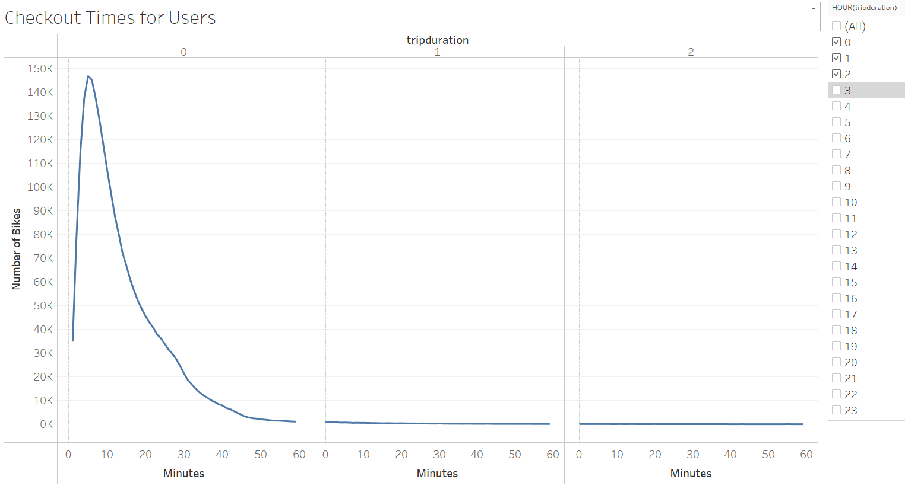
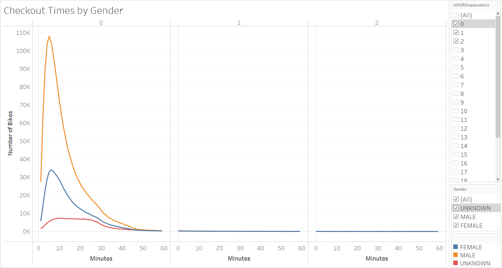
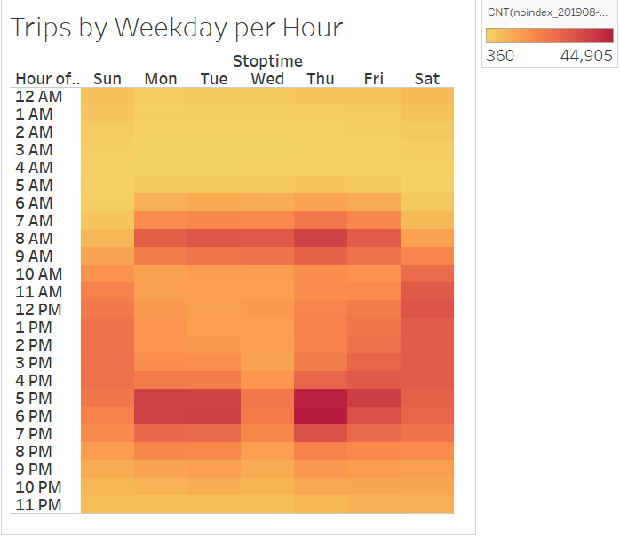
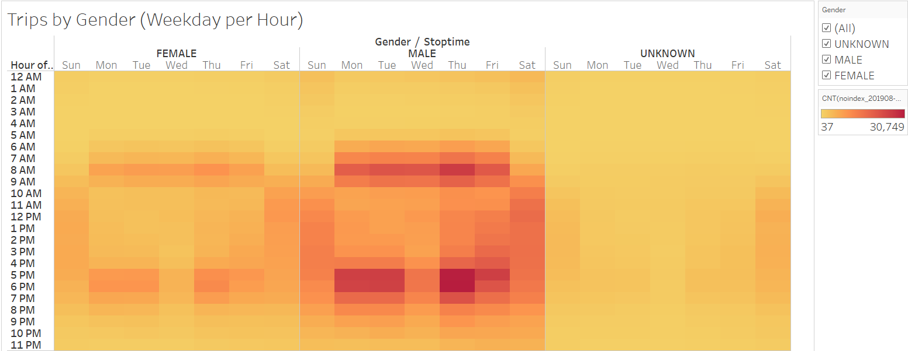

# bikesharing

Link to [Tableau Public Dashboard](https://public.tableau.com/views/NYCBikeshareAnalysis_16636315619250/NYCBikeshareStory?:language=en-US&publish=yes&:display_count=n&:origin=viz_share_link).

## Overview of the analysis:

The analysis was created to see how viable a bikeshare business would be for Des Moines, Iowa. Data from a bikeshare company called "CitiBike" in New York City was used to create the proposal. To get potential investors to buy into funding this bikeshare program different metrics were visually graphed. This visualized data was used to build a case for how a bikeshare might work in Des Moines, and to answer any questions the investors might have.

## Results:

### Visualizations
To begin, we will establish the questions that we would like answered. This takes into consideration that New York City is very different in terms of population, but intrinsic details can be pulled out that carry over to Des Moines. Furthermore, the data was kept exclusively to the month of August in 2019, which for either city would be the busiest time of year.
These questions are:

- How many people used the bikesharing program in August and what were peak hours.

- Where are people more likely to use a bikeshare program by visuizing start and end locations.

- Who these people generally are using a basic metric of gender.

- How long were the bikes being used and by which gender the most.

- Overall how many trips were being taken and then drilling this analysis further down by gender.

- A breakdown between a one time customer and a subscriber to the program drilled down to gender and weekday.

#### What is the amount of rides and peak hours for August 2019?

* The amount of rides for August 2019 tallied up to an astonishing 2,344,224 rides in that month. While the numbers may not be that high for Des Moines, the point established is that August was a busy month.

* With this data, we can then breakdown how busy was it on average over the course of a full day. The two groups of selected bars showcases that 7-10am and 4-7pm were the busiest blocks of time.

 
#### Where are users more likely to use the bikesharing program?

* Knowing the when, we move onto the where. Utilizing our dataset, two maps with colored markers were created to see the start and end locations and the popularity of each.

Top Starting Locations
 

Top Ending Locations

* We can glean that seemingly the more "tourist" parts of NYC get not only the most starts, but the most ends at similar locations in these high traffic areas. There are a decent contingent of what could be assumed are "local" riders in the less used areas. But they are very spread out and dwarfed by the areas more central and close to the sights of NYC. What we can definitely assume is that targeting Des Moine's popular attraction areas would lead to increased usage of the bikes.
 

#### Who is using the bikes the most by gender?

* Now that we know the when and the where, the next question to answer is who is using the bikeshare program the most? The data would be broken down by gender utilizing the amount of rides we calculated.

* Astonishingly the majority of people who use the bikeshare program are male. Since it is such an overwhelming amount, it can be inferred that this likely will be the same for Des Moines.
 

#### How long are the bikes being utilized and even further, by which gender?

* We know the when, but within that "when", how long are people actually using the bikes in a trip. Using checkout time data, we broke down this question into a line graph.

Bike Usage per Hour by 10 Minute Intervals

* The data shows that the massive majority of users are only going to be using the bike for a brief while, with the most common being 5 minutes for roughly 147,000 users. This drastically falls by the minute down to triple digits after crossing the hour threshold, and then to double digits into the third hour. The data does carry on for a minority of people past the third hour, but the bulk of the data showcases in the zero hour.

#### How many trips are the bikes being utilized by gender?

* Taking the previous calculated data, we can break it further down by gender again. As would be expected there are more male users, but the detail that can be inferred is that since the work industry is predominanty male, the the data shows a majority of male commuters utilizing the bikes for brief periods. Of course this can be applied to the same similar spike for females, which also would likely work commuters and locals commuting.

Bike Usage By Gender

* This data as a whole provides proof that besides tourist locations, business districs and the Des Moine downtown should not be ignored due to the potential of the bikes being used by workers for brief commutes.
 

#### Which weekday has the most bike usage by hour?

* We know the What, Where, and Who; and have dissected the total bike usage of August 2019 by the hour to show the utilization of the bikesharing program. This next question steps back a bit to see the bigger picture and tie in our previous findings.

Bike Usage per Weekday by the Hour

* The "hotspots" relate to the "Peak Hours" data, as the 7-10am and 4-7pm of the working days having the most trips. This also ties into the assumption that workers in NYC utilize the bikes in those commute hours. The weekends show a complete inverse of the weekday trips, with users using the bikes from 7am to 7pm. Peak usage on the weekend also aligns around lunch time, which would infer the bikes are used by likes weekend tourists to find a spot to eat.
 

#### Using the previous visulization, what more can the data tell us by gender and weekday?

* Finally, this weekday data can be further drilled down by gender.

Weekday Usage Hourly by Gender

* This data echoes all of our previous visualizations and solidify several key points. The morning and afternoon commute hours make up the time that a bulk of users are using the bikeshare program. There is a heavier slant towards male users, but the female users follow a similar pattern, albeit in lesser number. Interestingly, the "Unknown" value, which is a catch-all for user trips that a gender was not defined by the user, is almost non-existant for the weekday, but can be seen that these users are more active on the weekend. This could infer that the Uknown value is more than likely tourists, and not the consistent commuters reflected between the male and female values.
 

## Summary:

Provide a high-level summary of the results and two additional visualizations that you would perform with the given dataset.
There is a high-level summary of the results and two additional visualizations are suggested for future analysis

1.

2.
